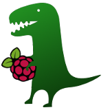

# PiRex Bot

PiRex Bot is a project aimed for building a robot based on Raspberry Pi board and camera module, as well as some additional conventional electronic components like L293D motor drive and HC-SR04 ultrasonic distance sensor. Based on common components used in a big variety of hobby projects, the robot represents a simple to build design and can be used as the base for further extensions.

Although a reference robot’s design is provided, the project is mainly aimed to provide reusable software to use for controlling Raspberry Pi robots built to a similar specification. The code base itself is heavily based on [cam2web](https://github.com/cvsandbox/cam2web) project, which provides about 95% of the infrastructure. Extending its design, the PiRex project adds motors’ control and distance measurement to the already provided camera streaming over HTTP.

The PiRex software provides embedded web UI, so the robot can be controlled directly from a web browser. In addition, it exposes REST API to interface with other applications. As a reference, the project provides a simple .NET client application, which allows more agile control of the robot by using game pad devices. The application also can be of use for adding image processing and computer vision based features to the robot.

* Reference robot design
* Building the source code
* Running the application
* Controlling robot from other applications (WEB API)
